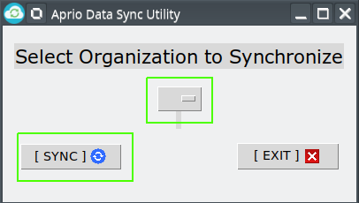

## Azure storage sync utility
> Project : Aprio @ Rsystems

## Installation
#### Dependencies:

- [Python3](https://www.python.org/downloads/)
- [Pip](https://bootstrap.pypa.io/get-pip.py)
- [Git](https://git-scm.com/downloads)

- Download & install python3 from above links.
- Download & install git from above links.
- Save `get-pip.py` file to Desktop.

#### One time steps

Open CMD    

& Install pip

```
cd Desktop
Python get-pip.py
pip install virtualenv
```

Clone project
```
git clone https://github.com/abhishek-rsystems/Aprio-azure-utility
cd project
```

Start Virtualenv (For Linux)
```
python3 -m venv venv
source venv/bin/activate
```

Start Virtualenv (For Windows)
```
python -m venv venv
venv\scripts\activate
```

Install Packages & rename the config
```
pip install -r requirements.txt
cp config.ini.example config.ini
```

& Edit `config.ini` file

### Running the utility

Extract `SampleData.zip` to `Data` Directory & make sure you have activated `venv` as stated above


Delete Azure blob storage/ Clean Up
```
python scripts/az_cleanup.py
```


GUI APP (Just Select The Organization & Sync one at a time to Azure)
```
python scripts/gtkapp.py
```

Select Organization Name & Click `Sync` on the Utility


<p align="center">

</p>